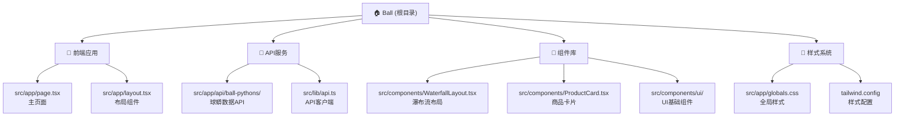

# Ball Python Marketplace - 项目文档

## 变更记录 (Changelog)

### 2025-08-29 10:31:16 - 项目架构分析完成
- 完成项目结构自动化分析
- 生成完整的模块文档和依赖关系映射
- 识别出4个主要功能模块：前端应用、API服务、组件库、样式系统

---

## 项目愿景

Ball Python Marketplace 是一个专门用于展示和浏览球蟒商品的在线平台。项目采用 Next.js 15 + React 19 技术栈，通过响应式瀑布流布局为用户提供优质的商品浏览体验，支持无限滚动加载和商品详细信息展示。

## 架构总览

- **技术栈**: Next.js 15.4.7, React 19.1.0, TypeScript 5, Tailwind CSS 4
- **UI框架**: shadcn/ui (基于 Radix UI)
- **包管理**: pnpm
- **部署平台**: Vercel (推荐)
- **数据来源**: Repttown API 第三方接口

## 模块结构图



## 模块索引

| 模块名称 | 路径 | 职责描述 | 入口文件 | 测试覆盖 |
|---------|------|----------|----------|----------|
| 前端应用 | `src/app/` | 主应用页面和布局，负责用户界面展示 | `page.tsx`, `layout.tsx` | ❌ 无测试 |
| API服务 | `src/app/api/` | 后端API路由，代理第三方数据接口 | `ball-pythons/route.ts` | ❌ 无测试 |
| 组件库 | `src/components/` | UI组件库，包含业务组件和基础UI组件 | `WaterfallLayout.tsx` | ❌ 无测试 |
| 样式系统 | `src/app/globals.css` | 全局样式和Tailwind配置 | `globals.css` | N/A |
| 工具函数 | `src/lib/` | 通用工具函数和API客户端 | `api.ts`, `utils.ts` | ❌ 无测试 |

## 运行与开发

### 环境要求
- Node.js 18+
- pnpm (推荐) 或 npm/yarn

### 快速开始
```bash
# 安装依赖
pnpm install

# 启动开发服务器
pnpm dev

# 构建生产版本
pnpm build

# 启动生产服务器
pnpm start

# 运行代码检查
pnpm lint
```

### 开发服务器
- 开发地址: http://localhost:3000
- 支持热重载和Turbopack加速

## 测试策略

⚠️ **当前状态**: 项目缺少测试覆盖

### 推荐测试框架
- **单元测试**: Jest + React Testing Library
- **端到端测试**: Playwright 或 Cypress
- **API测试**: Supertest

### 优先测试点
1. API路由功能测试 (`src/app/api/ball-pythons/route.ts`)
2. 数据转换函数测试 (`src/lib/api.ts`)
3. 瀑布流布局组件测试 (`src/components/WaterfallLayout.tsx`)
4. 商品卡片组件测试 (`src/components/ProductCard.tsx`)

## 编码规范

### 代码质量工具
- **ESLint**: 已配置 Next.js 和 TypeScript 规则
- **TypeScript**: 严格模式，类型安全
- **Prettier**: 建议添加代码格式化

### 文件组织规范
- 页面文件: `src/app/` (App Router)
- 组件文件: `src/components/` (按功能分组)
- 工具函数: `src/lib/` (通用工具)
- 样式文件: 使用 Tailwind CSS 类名

### 命名约定
- 组件文件: PascalCase (如 `ProductCard.tsx`)
- 工具函数: camelCase
- 类型定义: PascalCase interface

## AI 使用指引

### 架构理解
1. 这是一个前端驱动的电商展示应用
2. 数据通过API路由代理第三方接口获取
3. UI采用响应式设计，支持多设备适配
4. 组件化设计，易于维护和扩展

### 开发建议
1. **性能优化**: 考虑添加图片懒加载和虚拟滚动
2. **错误处理**: 增强API错误处理和用户反馈
3. **状态管理**: 如需复杂状态，考虑引入 Zustand 或 Redux Toolkit
4. **SEO优化**: 添加更详细的meta标签和结构化数据

### 扩展方向
- 添加商品详情页面
- 实现用户收藏功能
- 添加搜索和筛选功能
- 集成支付系统
- 添加商家管理后台

---
*文档最后更新: 2025-08-29 10:31:16*